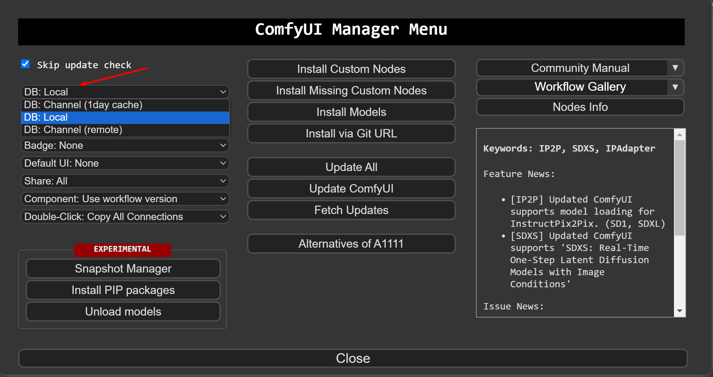

# How to Use a Popularity-Ranked Custom Nodes List with ComfyUI Manager

## Purpose:

The official list in the "Install Custom Nodes" section of [ComfyUI Manager](https://github.com/ltdrdata/ComfyUI-Manager) does not show the popularity of custom nodes. To address this, I have created a ranked list based on their popularity (GitHub Stars). This guide will show you how to use this ranked list.

## Step-by-Step Guide:

### Step 1. Download Ranked List:

Download the [custom-node-list.json](https://raw.githubusercontent.com/liusida/ComfyUI-Manager-CustomNodes-Ranked/main/custom-node-list.json) file.

### Step 2. Override the Original File:

Find the `ComfyUI/custom_nodes/ComfyUI-Manager/` directory where [ComfyUI Manager](https://github.com/ltdrdata/ComfyUI-Manager) is located.
Replace the existing `custom-node-list.json` file with the one you downloaded.

### Step 3. Change Database Source:

Open ComfyUI Manager.
In the dropdown menu that currently shows `"DB: Channel (1day cache)"`, select `"DB: Local"` instead.

### Step 4. View Ranked Custom Nodes:

Click on `"Install Custom Nodes"`.
The list will now reflect the nodes in ranked order according to their popularity.

### Reverting to Official Order:

If you wish to revert to the official ordering at any time:
Simply change the dropdown back to `"DB: Channel (1day cache)"`.
ComfyUI Manager will fetch the list from the official source.

## Awesome List of ComfyUI Manager Custom Nodes
Discover the most popular and community-endorsed custom nodes for ComfyUI Manager, ranked by their GitHub Stars as on April 1, 2024.

No. 1: [ComfyUI-Manager] https://github.com/ltdrdata/ComfyUI-Manager (Star: 3175)

No. 2: [ComfyUI_IPAdapter_plus] https://github.com/cubiq/ComfyUI_IPAdapter_plus (Star: 1881)

No. 3: [AnimateDiff Evolved] https://github.com/Kosinkadink/ComfyUI-AnimateDiff-Evolved (Star: 1863)

No. 4: [comfyui-portrait-master-zh-cn] https://github.com/ZHO-ZHO-ZHO/comfyui-portrait-master-zh-cn (Star: 1309)

No. 5: [ComfyUI-3D-Pack] https://github.com/MrForExample/ComfyUI-3D-Pack (Star: 1250)

No. 6: [ComfyUI's ControlNet Auxiliary Preprocessors] https://github.com/Fannovel16/comfyui_controlnet_aux (Star: 1111)

No. 7: [ComfyUI Impact Pack] https://github.com/ltdrdata/ComfyUI-Impact-Pack (Star: 1062)

No. 8: [ComfyUI-InstantID] https://github.com/ZHO-ZHO-ZHO/ComfyUI-InstantID (Star: 1034)

No. 9: [pythongosssss/ComfyUI-Custom-Scripts] https://github.com/pythongosssss/ComfyUI-Custom-Scripts (Star: 995)

No. 10: [Stable Diffusion Dynamic Thresholding (CFG Scale Fix)] https://github.com/mcmonkeyprojects/sd-dynamic-thresholding (Star: 978)

No. 11: [ComfyUI-layerdiffuse (layerdiffusion)] https://github.com/huchenlei/ComfyUI-layerdiffuse (Star: 940)

No. 12: [ReActor Node for ComfyUI] https://github.com/Gourieff/comfyui-reactor-node (Star: 790)

No. 13: [ComfyUI-SUPIR] https://github.com/kijai/ComfyUI-SUPIR (Star: 767)

No. 14: [WAS Node Suite] https://github.com/WASasquatch/was-node-suite-comfyui (Star: 754)

No. 15: [ComfyUI PhotoMaker (ZHO)] https://github.com/ZHO-ZHO-ZHO/ComfyUI-PhotoMaker-ZHO (Star: 694)

No. 16: [SeargeSDXL] https://github.com/SeargeDP/SeargeSDXL (Star: 675)

No. 17: [comfyui-portrait-master] https://github.com/florestefano1975/comfyui-portrait-master (Star: 644)

No. 18: [AIGODLIKE-COMFYUI-TRANSLATION] https://github.com/AIGODLIKE/AIGODLIKE-COMFYUI-TRANSLATION (Star: 633)

No. 19: [comfyui-mixlab-nodes] https://github.com/shadowcz007/comfyui-mixlab-nodes (Star: 607)

No. 20: [One Button Prompt] https://github.com/AIrjen/OneButtonPrompt (Star: 601)

## Acknowledgements:

A heartfelt thank you to the authors and contributors of [ComfyUI](https://github.com/comfyanonymous/ComfyUI) and [ComfyUI-Manager](https://github.com/ltdrdata/ComfyUI-Manager) for providing such excellent tools that empower the community on AI-generated content creation.

